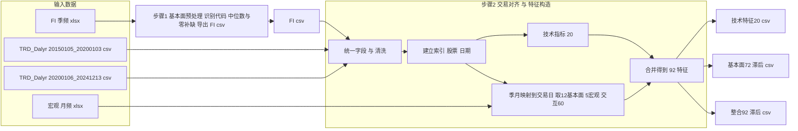
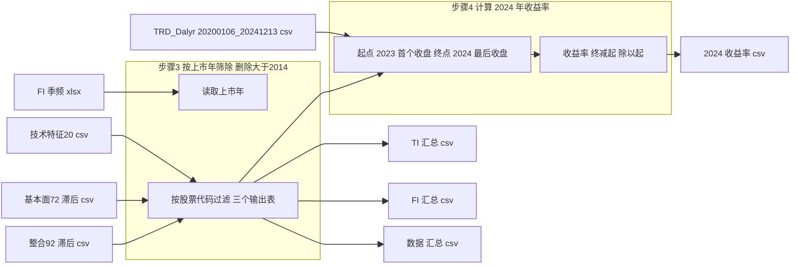

# Prediction-Based Portfolio Management with Higher-Order Moments Using Big Data-Driven Machine Learning and Deep Learning in Chinese Stock Market

SHI ZEREN (PFM233045)

## Chapter 4: Results and Discussion

### 4. Stock Big Data Integration

**CSI 300 成分股原始数据(https://)：**  
个股日交易数据：TRD_Dalyr(20150105-20200103).csv、TRD_Dalyr(20200106-20241213).csv;  
公司基本面数据：FI(季频).xls;  
中国宏观经济数据：macroeconomic(月频).xls;  
成分股行业分类数据：CSI300成分股行业分类.xls。

**Step 1**：由于FI有缺失值，尤其是银行股的个别列缺失严重，所以首先进行数据填充。

**Step 2**：由于基本面指标和宏观经济变量的统计具有滞后性，所以要用前一季度/月度的数据进行训练及预测：即一季度的FIs要用上年第四季度的，一月的Macro要用上年十二月的，以此类推。同时需要对齐数据维度，选择日期索引的方法。如下所示：

| Date | TI₁...TI₂₀ | FI₁...FI₁₂ |     FIᵢ × Macro (12×5)     |
| :--: | :-----------: | :-----------: | :---------------------------: |
|  Q1  |  Jan Feb Mar  |      Q4      | Q4 × Dec Q4 × Jan Q4 × Feb |
|  Q2  |  Apr May Jun  |      Q1      | Q1 × Mar Q1 × Apr Q1 × May |
|  Q3  |  Jul Aug Sep  |      Q2      | Q2 × Jun Q2 × Jul Q2 × Aug |
|  Q4  |  Oct Nov Dec  |      Q3      | Q3 × Sep Q3 × Oct Q3 × Nov |

This study defined the vector of predictors $z_{i,t}$, which consists of the FIs, the interaction terms between firm-level fundamentals and macroeconomic variables, and a set of TIs of stock $i$, which was represented in Equation:

$$z_{i,t}=\begin{pmatrix}f_{i,t}\\\\m_t\otimes f_{i,t}\\\\x_{i,t}\end{pmatrix},$$

where $f_{i,t}$ is a 12 $\times$ 1 vector of firm-level fundamentals, $m_t$ is a 5 $\times$ 1 vector of macroeconomic variables, $x_{i,t}$ is a 20 $\times$ 1 vector of TIs, and $\otimes$ denotes the Kronecker product. Hence, the total number of predictors in $z_{i,t}$ is $12 \times (5 + 1) + 20 = 92$.

**Step 3**：Study period为2015-2024的有效数据，由于变量具有滞后性，筛选排除上市时间晚于2014.12的股票：最终股票数量162->141 (CSI 141)。

### 4.2 Data Descriptive Statistics

* Calculate the statistical information for all constituent stocks and examine their normality.
* Display the scatterplot illustrating the relationship between FIs and stock returns (2024).
* Display a heatmap showing the relationship between FIs and TIs (averaged across all stocks).

### 4.3 Clustering Results

* Compare the performance of different clustering methods using EW investment vs. CSI 141 benchmark, and obtain the clustered stock lists by year (2020-2024).
* Display CR and IR (risk-return) bubble chart for portfolios based on different clustering methods.

### 4.4 Performance of Big Data-Driven Predictive Models

* Yearly performance comparison of RF and LSTM on (1) FI (2) TI (3) Big data, with Mann-Whitney tests to assess differences in prediction errors across datasets.
* Performance comparison with various popular predictive models--ARIMA, SVR, RF, CNN, RNN, LSTM .
* Diebold-Mariano test to evaluate performance differences between predictive models.

### 4.5 Solving the Proposed Model and File Processing

Solving all models [MV, MSV, MAD, MSAD, Omega, CVaR] across each extension (Original, –H, –P, –HP), and export corresponding data for subsequent performance analysis and comparison.

#### 4.5.1 Validity and Profitability

* Ablation experiments: net value comparison across different portfolio model families (Original, –H, –P, –HP).
* Net value differences between the proposed –HP extensions and their original counterparts.
* Statistical summary of all PO models.
* Newey-West test to determine whether the proposed models' returns significantly exceed the risk-free rate.

#### 4.5.2 Within-Model Analysis

* Comparison with RF-based –HP portfolio models.
* Comparison of return characteristics of LSTM-based –HP models across (1) FI (2) TI (3) Big data.

#### 4.5.3 Comparison between models

* Monthly ER comparison across all –HP extensions for each year.
* Boxplot distribution of monthly ER for all –HP extensions.
* Friedman and Wilcoxon signed-rank tests to assess differences among the proposed models.

#### 4.6.1 Validity and Profitability under Transaction Costs

* Ablation experiments comparing net values of each extension (0.1%).
* Net value differences between the proposed –HP extensions and their original counterparts (0.1%).
* Performance summary of all portfolio models under different transaction costs.
* Waterfall plot visualizing the differences in gross return → transaction costs → net return for each –HP model.
* Newey-West test with the same objective as described in 4.5.1.

#### 4.6.2 Between-Model Comparison under Transaction Costs

* Comparison of CR across all –HP models (0.1%).
* Monthly ER comparison across all –HP models for each year (0.1%).
* Boxplot distribution of monthly ER for all –HP models (0.1%).
* Friedman and Wilcoxon signed-rank tests with the same objective as described in 4.5.3.

***Note:*** Most of the simulation code was run on a CPU (13th Gen Intel Core i7-13700H) and GPU (NVIDIA GeForce RTX 3050 4GB). Time-consuming operations such as clustering, predictive modeling, and portfolio model solving were all executed on Cloud Servers.
